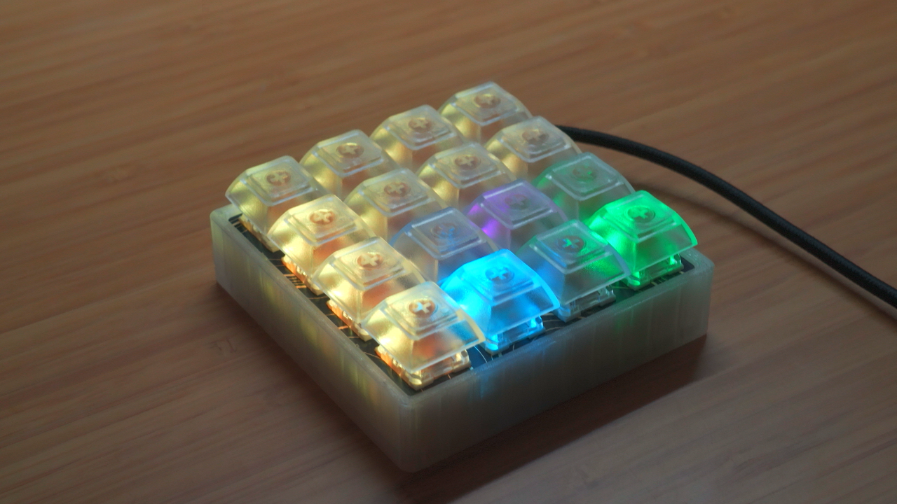
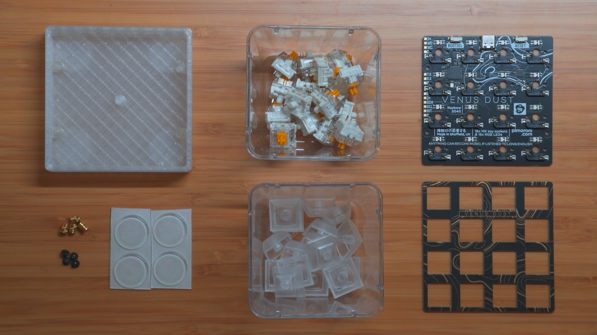
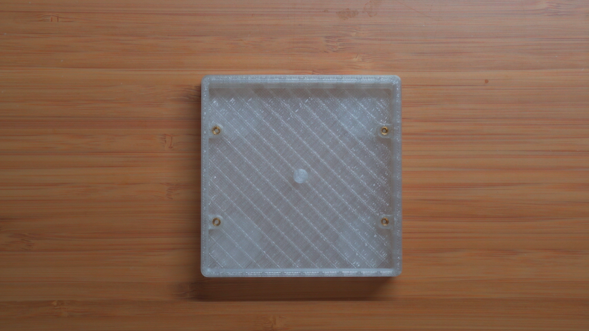
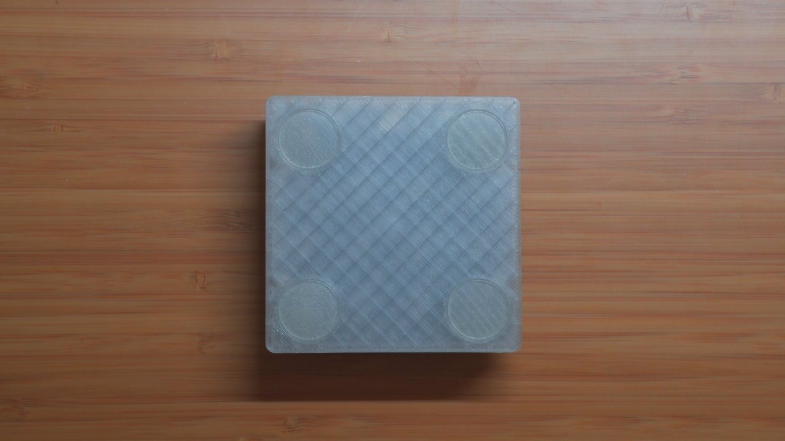
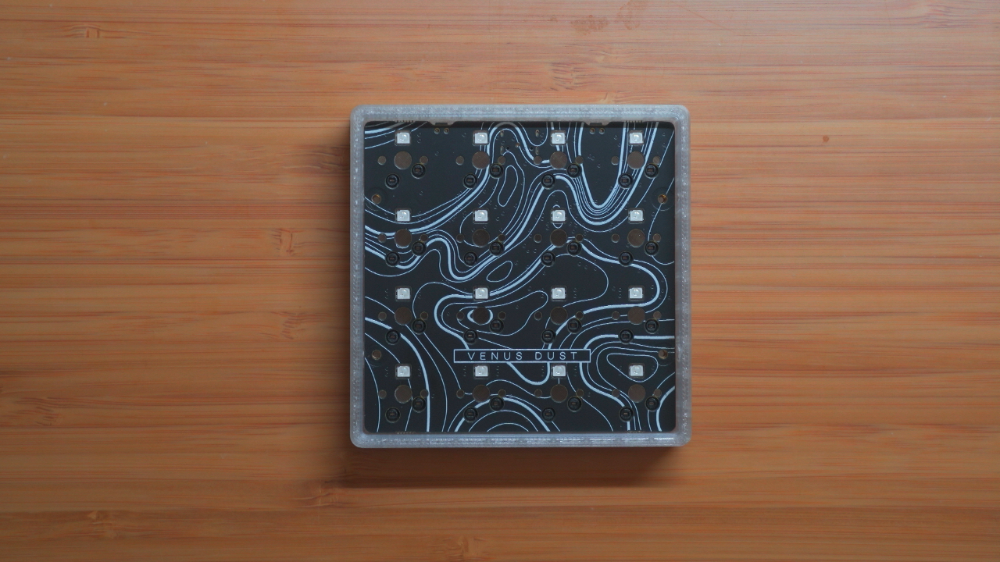
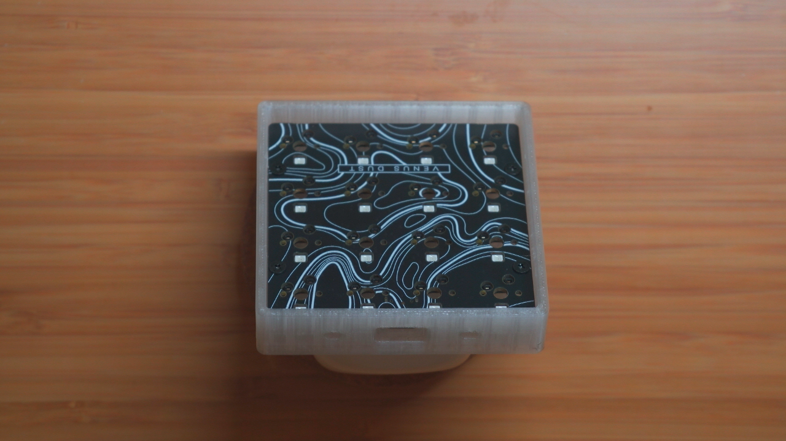
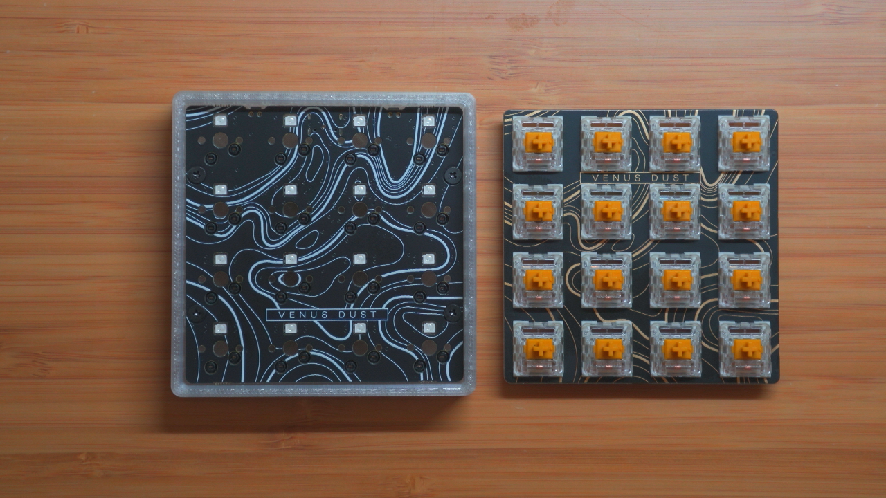
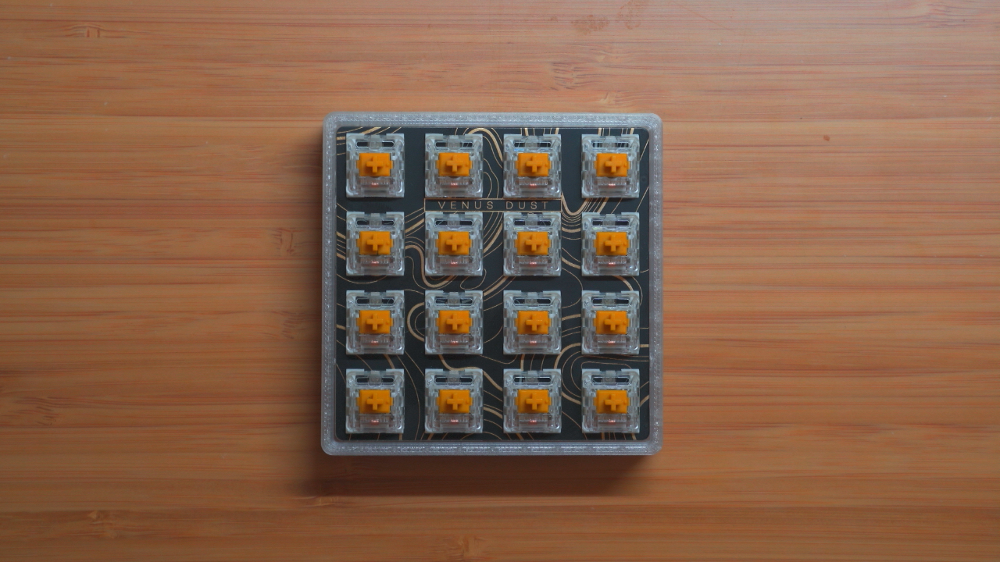
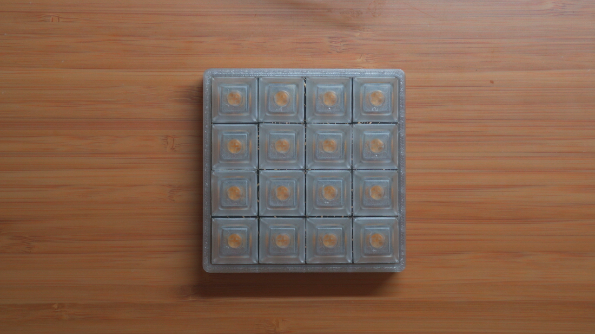

# Keybow 2040 Case

3D printable case for [Keybow 2040](https://shop.pimoroni.com/products/keybow-2040)

## BOM

- Keybow 2040 `*`
- 16x key switches `*`
- 16x key caps `*`
- 4x M2 screws `*`
- 4x M2 heatset inserts
- 4x 20x2mm circular rubber feet
- Printed case

*Items marked with `*` are included in the Keybow 2040 kit.*

## Case Assembly

*If you have specialized iron tips for heatset inserts, swap in an M2 insert.*

It's recommended to print the case oriented with the rubber feet facing down. Add supports for the rubber feet spaces and USB-C port

1. Remove supports from the print
2. Set a soldering iron to the recommended temperature depending on the material of choice (I use 240 degrees F for PLA)
3. Place an M2 heat set insert into a standoff hole, slowly press soldering iron into insert. Continue until the surface of the insert is flush with the standoff surface
4. Repeat for the remaining 3 inserts.

5. Add rubber feet into the spaces on the bottom of the case

## Device Assembly

1. Insert main pcba into the case. Surface mounted parts should be facing down and usb port should align with the cutout in the case.

2. Insert and tighten the 4x M2 screws.

3. Orient the switch panel and insert key switches. Make sure all key switches are oriented correctly (Gap on the key switch should be facing the side of the main pcb with USB-C and buttons).

4. Slowly but firmly press switches into the main pcba until all four corners of the switch panelare flush with the case.

5. Press key caps onto the switches

